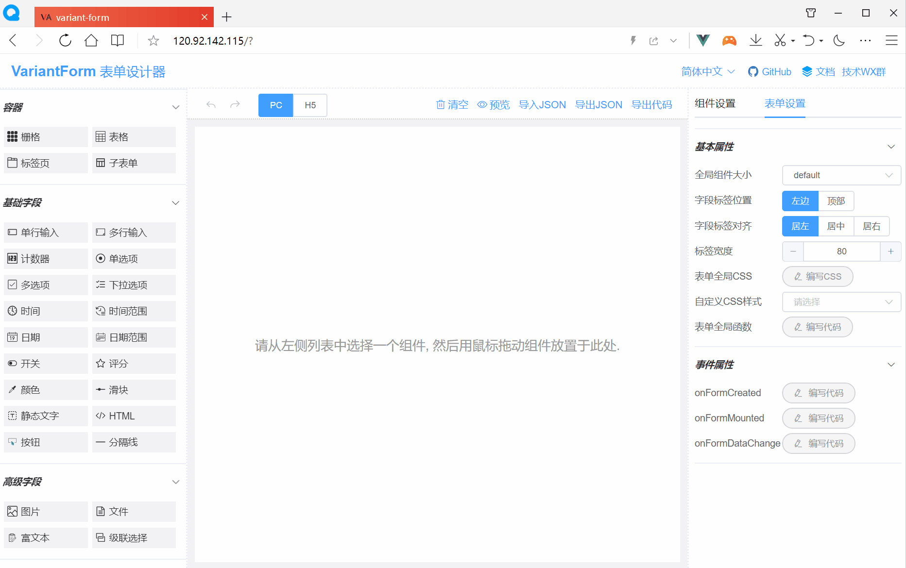

# Vue 3低代码表单组件

一款高效的 Vue 3 低代码表单，可视化设计。基于 [variant-form3](https://github.com/vform666/variant-form3-vite) 项目二次开发，感谢原作者的无私奉献。新增了通过插槽自定义表单组件的功能（使用示例见 App.vue）。



[在线示例](https://div11_tst.byd.com/rd_system/#/form/tool?__full__) | [B站视频](https://space.bilibili.com/626932375) | [官方文档](https://vform.librejo.cn/visualdev/vform3)

## 安装
修改 `.npmrc` 文件，添加如下内容：
```bash
@byd:registry=http://hub.byd.com:9081/repository/npm-local
```

执行

```bash
npm i @byd/byd-vform3
```

## 使用

- 安装包

```typescript
import { createApp } from 'vue'
import App from './App.vue'

import ElementPlus from 'element-plus'  //引入element-plus库
import 'element-plus/dist/index.css'  //引入element-plus样式

import VForm3 from 'byd-vform3'  //引入VForm 3库
import 'byd-vform3/dist/designer.style.css'  //引入VForm3样式

const app = createApp(App)
app.use(ElementPlus)  //全局注册element-plus
app.use(VForm3)  //全局注册VForm 3 (同时注册了v-form-designer和v-form-render组件)

app.mount('#app')
```

- 使用表单设计器

```vue
<template>
  <v-form-designer ref="vfdRef"></v-form-designer>
</template>

<script setup>
const vfdRef = ref(null)
</script>

<style lang="scss">
body {
  margin: 0;  /* 如果页面出现垂直滚动条，则加入此行CSS以消除之 */
}
</style>
```

<br/>

- 表单渲染器组件

```vue
<template>
<div>
 <v-form-render :form-json="formJson" :form-data="formData" :option-data="optionData" ref="vFormRef">
 </v-form-render>
 <el-button type="primary" @click="submitForm">Submit</el-button>
</div>
</template>
<script setup>
import { ref, reactive } from 'vue'
import { ElMessage } from 'element-plus'

const formJson = reactive({"widgetList":[],"formConfig":{"modelName":"formData","refName":"vForm","rulesName":"rules","labelWidth":80,"labelPosition":"left","size":"","labelAlign":"label-left-align","cssCode":"","customClass":"","functions":"","layoutType":"PC","jsonVersion":3,"onFormCreated":"","onFormMounted":"","onFormDataChange":""}})
const formData = reactive({})
const optionData = reactive({})
const vFormRef = ref(null)

const submitForm = () => {
 vFormRef.value.getFormData().then(formData => {
   // Form Validation OK
   alert( JSON.stringify(formData) )
 }).catch(error => {
   // Form Validation failed
   ElMessage.error(error)
 })
}
</script>
```